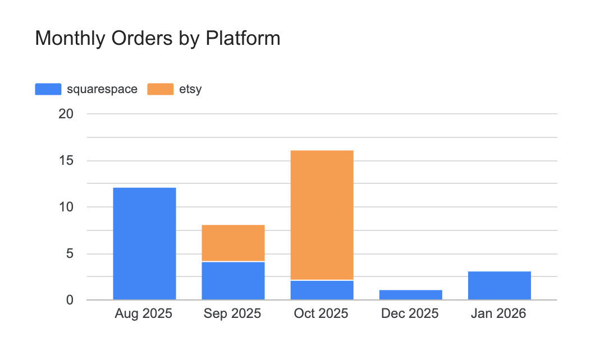
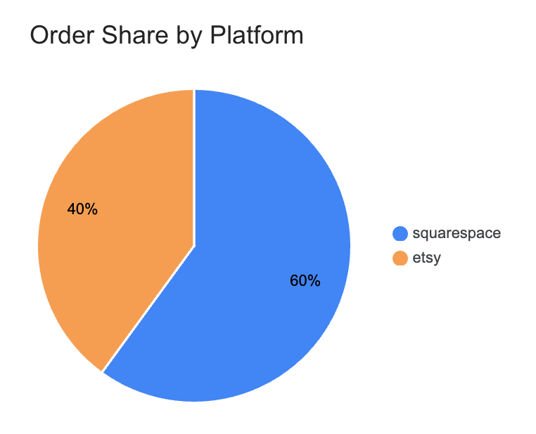

# Multi-Platform E-commerce Analytics Pipeline

An automated data pipeline that consolidates order and inventory data from multiple e-commerce platforms (Etsy, Squarespace) into a unified analytics layer in Google Sheets. Built to power cross-platform sales reporting and inventory tracking for a multi-channel commerce business.

## Overview

This pipeline solves a common problem for multi-channel sellers: order and inventory data lives in separate platforms, each with its own API schema, making consolidated analysis difficult. The pipeline ingests data from each platform's API, normalizes it into a canonical schema, and writes it to a centralized Google Sheets data store that feeds a Looker Studio dashboard.

```
   Etsy API ──────┐
                  │
                  |──► Normalize ──► Google Sheets ──► Looker Studio
   Squarespace    │    (canonical    (data store,      (dashboard)
   Commerce API───┘     schema)       deduplicated)
  
```

## Dashboard

The consolidated data feeds a Looker Studio dashboard for cross-platform sales analysis.

### Monthly Orders by Platform



### Order Share by Platform



## Features

- **Multi-source ingestion** — Pulls orders and inventory from Etsy and Squarespace Commerce APIs.
- **OAuth 2.0 (PKCE)** — Implements Etsy's PKCE authorization flow, with automatic token refresh for unattended runs.
- **Canonical normalization** — Standardizes order data across platforms with different API schemas; expands order line items into individual records for unified reporting.
- **Idempotent writes** — Deduplication logic (keyed on `order_id` + `platform`) ensures repeated runs never create duplicate records.
- **Incremental & full sync** — Supports incremental pulls (by day range or since a specific date) as well as full historical backfills.
- **Scheduled automation** — Runs daily via GitHub Actions, with Etsy tokens auto-refreshed and GitHub Secrets updated programmatically.

## Tech Stack

| Layer | Tools |
|-------|-------|
| Language | Python 3.11 |
| APIs | Etsy Open API v3, Squarespace Commerce API, Google Sheets API |
| Auth | OAuth 2.0 with PKCE |
| Storage | Google Sheets (via `gspread`) |
| Orchestration | GitHub Actions (scheduled workflows) |
| Visualization | Looker Studio |

## Project Structure

```
ecommerce-analytics-pipeline/
├── .github/workflows/
│   └── daily_sync.yml          # Scheduled daily sync workflow
├── src/
│   ├── squarespace_client.py   # Squarespace Commerce API client
│   ├── etsy_client.py          # Etsy Open API v3 client
│   ├── normalize.py            # Canonical schema normalization
│   ├── sheets_writer.py        # Google Sheets writer with dedup
│   ├── fetch_orders.py         # Main entry point (CLI with args)
│   └── refresh_etsy_token.py   # OAuth token refresh utility
├── screenshots/                # Dashboard screenshots
├── etsy_auth.py                # One-time Etsy authorization script
├── requirements.txt
└── README.md
```

## Setup

### 1. Install dependencies

```bash
python3 -m venv venv
source venv/bin/activate
pip install -r requirements.txt
```

### 2. Configure environment variables

Create a `.env` file in the project root (API credentials required):

```
# Etsy
ETSY_API_KEY=your_keystring
ETSY_SHARED_SECRET=your_shared_secret
ETSY_SHOP_ID=your_shop_id
ETSY_SHOP_NAME=your_shop_name
ETSY_ACCESS_TOKEN=          # populated by etsy_auth.py
ETSY_REFRESH_TOKEN=         # populated by etsy_auth.py

# Squarespace
SQUARESPACE_API_KEY=your_api_key

# Google Sheets
GOOGLE_CREDENTIALS_PATH=./credentials.json
SPREADSHEET_ID=your_spreadsheet_id
```

### 3. Set up Google Sheets access

- Create a Google Cloud project, enable the Google Sheets API and Google Drive API.
- Create a Service Account and download its JSON key as `credentials.json`.
- Share your target spreadsheet with the Service Account email (Editor access).

### 4. Authorize Etsy (one-time)

```bash
python etsy_auth.py
```

This opens an OAuth (PKCE) flow in the browser. After authorizing, the access and refresh tokens are written to `.env` automatically. The refresh token is used for all subsequent unattended runs.

## Usage

The main entry point is `src/fetch_orders.py`, which accepts command-line arguments to control the sync mode, date range, and platform.

```bash
# Default: pull the last 7 days
python src/fetch_orders.py

# Pull the last 30 days
python src/fetch_orders.py --days 30

# Full historical backfill (all available data)
python src/fetch_orders.py --mode full

# Pull everything since a specific date
python src/fetch_orders.py --since 2025-01-01

# Pull only Etsy
python src/fetch_orders.py --platform etsy

# Pull only Squarespace, last 14 days
python src/fetch_orders.py --platform squarespace --days 14
```

### Arguments

| Argument | Values | Default | Description |
|----------|--------|---------|-------------|
| `--mode` | `incremental`, `full` | `incremental` | Incremental pulls a date range; full pulls all data |
| `--days` | integer | `7` | In incremental mode, number of past days to pull |
| `--since` | `YYYY-MM-DD` | none | Custom start date (overrides `--days`) |
| `--platform` | `all`, `squarespace`, `etsy` | `all` | Which platform(s) to pull |

### Backfilling historical data

If the scheduled job misses several days (or you need to recover after a gap), run a backfill covering the missing window. Because writes are idempotent, overlapping with already-synced data is safe — duplicates are skipped.

```bash
# Backfill a specific window from a start date to now
python src/fetch_orders.py --since 2025-10-01

# Backfill the last N days (e.g. recover a 14-day gap)
python src/fetch_orders.py --days 14

# Re-sync the entire history if needed
python src/fetch_orders.py --mode full
```

## Automated Daily Sync

The pipeline runs automatically every day via GitHub Actions (`.github/workflows/daily_sync.yml`):

1. Refreshes the Etsy access token using the stored refresh token, and updates the corresponding GitHub Secrets programmatically (so the next run has a valid token).
2. Pulls the last day's orders and inventory from each platform.
3. Normalizes and writes the data to Google Sheets, skipping any records already present.

### Required GitHub Secrets

| Secret | Description |
|--------|-------------|
| `SQUARESPACE_API_KEY` | Squarespace Commerce API key |
| `ETSY_API_KEY` | Etsy keystring |
| `ETSY_SHARED_SECRET` | Etsy shared secret |
| `ETSY_ACCESS_TOKEN` | Etsy access token (auto-refreshed) |
| `ETSY_REFRESH_TOKEN` | Etsy refresh token (auto-refreshed) |
| `ETSY_SHOP_ID` | Etsy numeric shop ID |
| `ETSY_SHOP_NAME` | Etsy shop name |
| `SPREADSHEET_ID` | Target Google Sheets ID |
| `GOOGLE_CREDENTIALS_JSON` | Full contents of the Service Account JSON key |
| `GH_PAT` | GitHub Personal Access Token (to update secrets) |

The workflow can also be triggered manually from the Actions tab via `workflow_dispatch`.

## Data Model

Orders are normalized into a canonical schema, with each order line item as its own row:

| Field | Description |
|-------|-------------|
| `order_id` | Platform order/receipt ID |
| `platform` | `squarespace` / `etsy` |
| `created_at` | Order timestamp (ISO 8601) |
| `sku` | Product SKU |
| `product_name` | Product name |
| `variant` | Variant/options (e.g. color, size) |
| `quantity` | Quantity ordered |
| `unit_price` | Unit price |
| `subtotal` | Order subtotal |
| `discount` | Discount applied |
| `grand_total` | Total paid |
| `fulfillment_status` | Fulfillment status |
| `currency` | Currency code |

Each platform exposes pricing differently (e.g. Squarespace uses string values, Etsy uses an `amount`/`divisor` integer pair). The normalization layer reconciles these into consistent numeric fields.

## Design Notes & Future Work

- **Storage** — Google Sheets is well-suited to the current data volume and makes the data immediately accessible in Looker Studio. At larger scale, the natural next step is migrating the data store to BigQuery or Snowflake.
- **Transformation layer** — Normalization is currently handled in Python. Introducing dbt would add data tests, documentation, and a versioned modeling layer.
- **Order updates** — The current design is append-only with deduplication. Handling status changes or refunds would require upsert (update-or-insert) logic keyed on `order_id` + `platform`.

